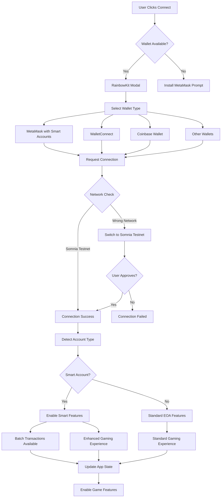
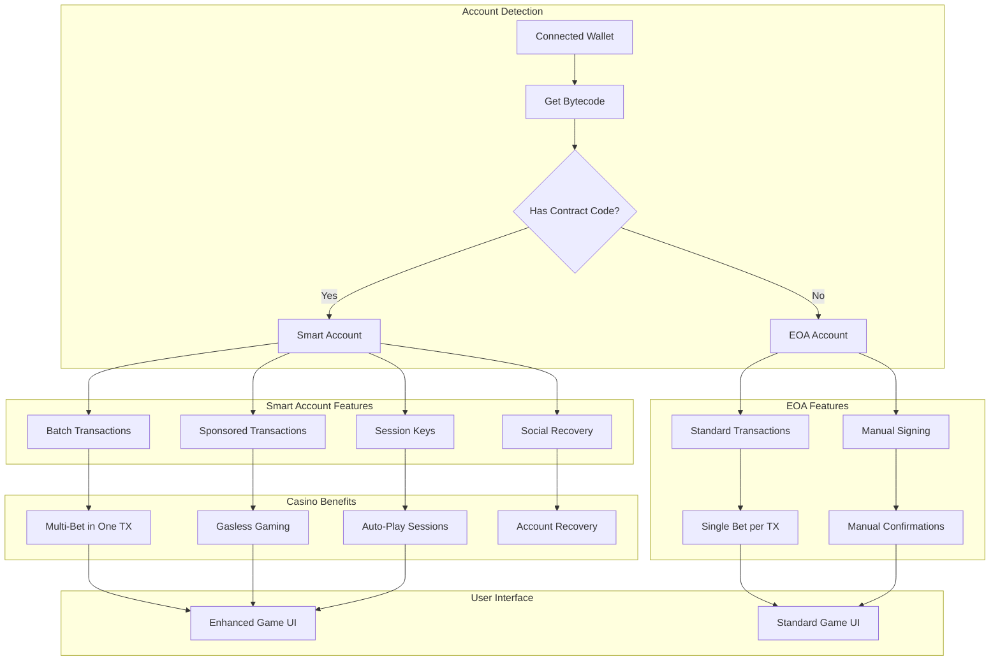
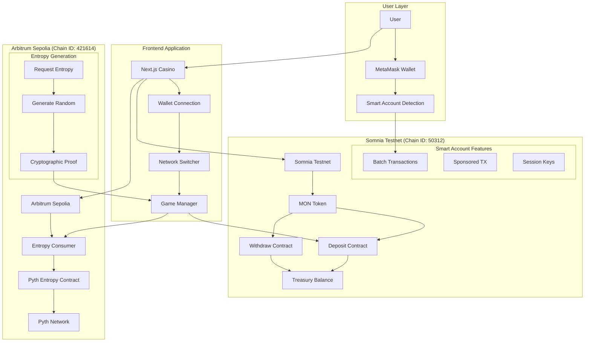
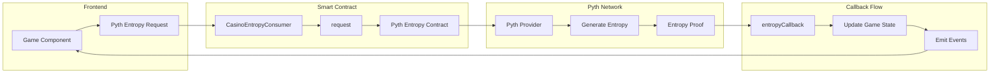
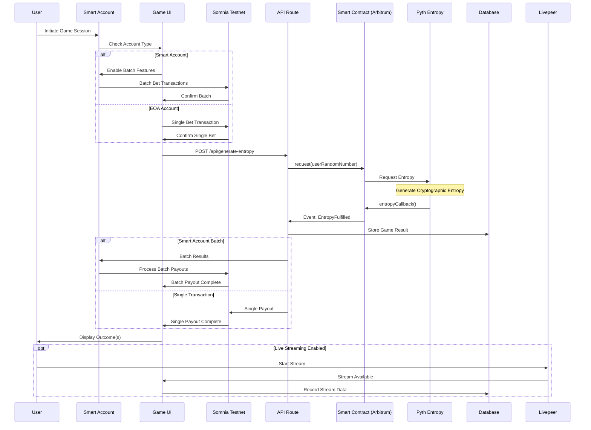
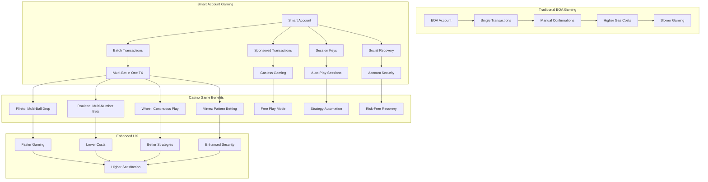
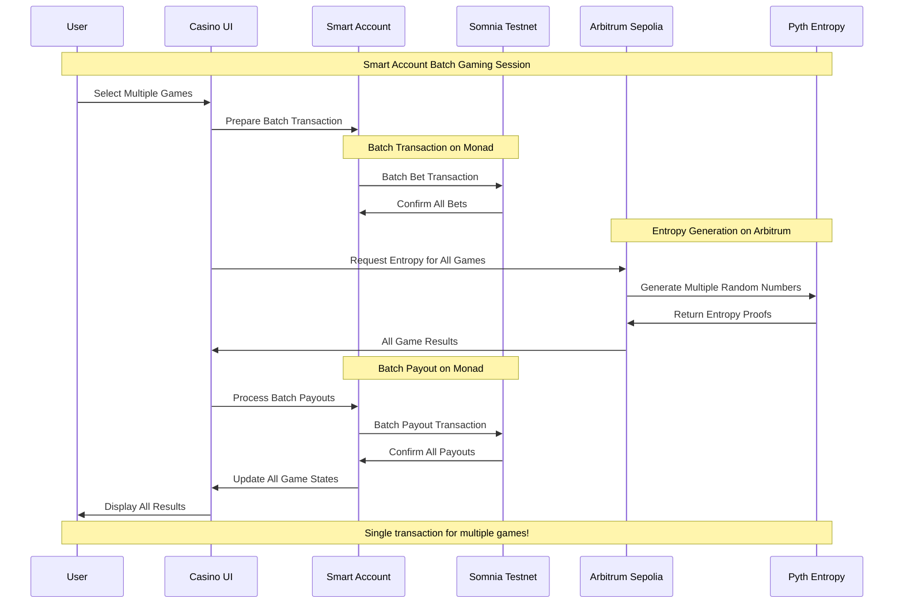
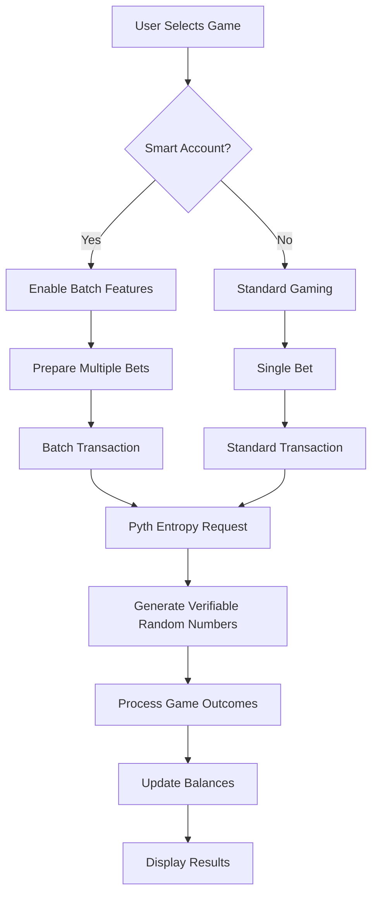

# APT Casino - Somnia Network

A decentralized casino platform built on Somnia Network with Pyth Entropy for provably fair gaming and MetaMask Smart Accounts integration.

## 🎮 The Story Behind APT Casino

A few days ago, I was exploring transactions on Etherscan when I saw an advertisement for a popular centralized casino platform offering a 200% bonus on first deposits. I deposited 120 USDT and received 360 USDT in total balance in their custodial wallet.

When I started playing, I discovered I could only bet $1 per game and couldn't increase the amount. After contacting customer support, I learned I had been trapped by hidden "wager limits" tied to the bonus scheme. To withdraw my original deposit, I would need to play $12,300 worth of games!

In a desperate attempt to recover my funds, I played different games all night—roulette, mines, spin wheel—and lost everything.

This frustrating experience inspired APT Casino: a combination of GameFi, AI, and DeFi where users can enjoy casino games in a safe, secure, and transparent environment that doesn't scam its users.

## 🎯 The Problem

The traditional online gambling industry suffers from several issues:

- **Unfair Game Outcomes**: 99% of platforms manipulate game results, leading to unfair play
- **High Fees**: Exorbitant charges for deposits, withdrawals, and gameplay
- **Restrictive Withdrawal Policies**: Conditions that prevent users from accessing their funds
- **Misleading Bonus Schemes**: Trapping users with unrealistic wagering requirements
- **Lack of True Asset Ownership**: Centralized control over user funds
- **User Adoption Barriers**: Complexity of using wallets creates friction for web2 users
- **No Social Layer**: Lack of live streaming, community chat, and collaborative experiences

## 💡 Our Solution

APT Casino addresses these problems by offering:

- **Provably Fair Gaming**: Powered by Pyth Entropy


- **Multiple Games**: Wheel, Roulette, Plinko, and Mines with verifiable outcomes
- **MetaMask Smart Accounts**: Enhanced wallet experience with batch transactions
- **STT/SOMI Token**: Native currency for Somnia Network (STT for testnet, SOMI for mainnet)
- **Flexible Withdrawal**: Unrestricted access to funds
- **Transparent Bonuses**: Clear terms without hidden traps
- **True Asset Ownership**: Decentralized asset management
- **Live Streaming Integration**: Built with Livepeer, enabling real-time game streams and tournaments
- **On-Chain Chat**: Supabase + Socket.IO with wallet-signed messages for verifiable player communication
- **Gasless Gaming Experience**: Treasury-sponsored transactions for seamless web2-like experience

## 🌟 Key Features

### 1. Smart Account Integration

- **Batch Transactions**: Multiple bets in one transaction
- **Delegated Gaming**: Authorize strategies to play on your behalf
- **Lower Gas Costs**: Optimized for frequent players
- **Enhanced Security**: Smart contract-based accounts

### 2. Provably Fair Gaming


- **Pyth Entropy**: Cryptographically secure randomness
- **On-Chain Verification**: All game outcomes verifiable
- **Transparent Mechanics**: Open-source game logic

### 3. Multi-Chain Architecture

- **Gaming Network**: Somnia Network (Chain ID: 50312 for testnet, 5031 for mainnet)
- **Entropy Network**: Pyth Entropy on Somnia Network

### 4. Game Selection

- **Roulette**: European roulette with Smart Account batch betting
- **Mines**: Strategic mine-sweeping with delegated pattern betting
- **Plinko**: Physics-based ball drop with auto-betting features
- **Wheel**: Classic spinning wheel with multiple risk levels

### 5. Social Features

- **Live Streaming**: Integrated with Livepeer for real-time game streams and tournaments
- **On-Chain Chat**: Real-time communication with wallet-signed messages
- **Player Profiles**: NFT-based profiles with gaming history and achievements
- **Community Events**: Tournaments and collaborative gaming experiences

### 6. Web2 User Experience

- **Gasless Transactions**: Treasury-sponsored transactions eliminate gas fees
- **Seamless Onboarding**: Simplified wallet experience for web2 users
- **Familiar Interface**: Web2-like experience with web3 benefits

## 🚀 Getting Started

1. **Connect Wallet**: Connect your MetaMask wallet to Somnia Network
2. **Get Tokens**: Get STT tokens from the Somnia testnet faucet (https://testnet.somnia.network/)
3. **Deposit**: Deposit STT to your house balance
4. **Play**: Start playing provably fair games!

### Network Configuration

Add Somnia Testnet to MetaMask:
- **Network Name**: Somnia Testnet
- **RPC URL**: `https://dream-rpc.somnia.network/`
- **Chain ID**: `50312`
- **Currency Symbol**: `STT`
- **Block Explorer**: `https://shannon-explorer.somnia.network/`

Add Somnia Mainnet to MetaMask:
- **Network Name**: Somnia Mainnet
- **RPC URL**: `https://api.infra.mainnet.somnia.network/`
- **Chain ID**: `5031`
- **Currency Symbol**: `SOMI`
- **Block Explorer**: `https://explorer.somnia.network`

## 🔷 Smart Account Features

APT Casino leverages MetaMask Smart Accounts for an enhanced gaming experience:

### Delegation Benefits:
- **Auto-Betting Strategies**: Delegate betting permissions to strategy contracts
- **Batch Gaming Sessions**: Play multiple games in a single transaction
- **Session-Based Gaming**: Set time-limited permissions for continuous play
- **Gasless Gaming**: Sponsored transactions for smoother experience

### Usage:
```javascript
// Create a delegation for auto-betting
const createAutoBetDelegation = async (maxBet, timeLimit, gameTypes) => {
  return delegationRegistry.createDelegation({
    delegatee: strategyContract,
    constraints: {
      maxAmount: maxBet,
      validUntil: timeLimit,
      allowedGames: gameTypes
    }
  });
};

// Execute batch bets through delegation
const executeBatchBets = async (bets) => {
  return delegationRegistry.executeDelegatedTransactions({
    delegationId,
    transactions: bets.map(bet => ({
      to: bet.gameContract,
      data: bet.data,
      value: bet.amount
    }))
  });
};
```

## 🏗 System Architecture Overview

```mermaid
graph TB
    subgraph Frontend["Frontend Layer"]
        A[Next.js App] --> B[React Components]
        B --> C[Three.js Games]
        B --> D[Material-UI]
        B --> E[RainbowKit + MetaMask Smart Accounts]
        E --> SA[Smart Account Detection]
        B --> LS[Livepeer Streaming]
        B --> CC[Community Chat]
    end
    
    subgraph State["State Management"]
        F[Redux Store] --> G[React Query]
        G --> H[Local State]
        H --> SAH[Smart Account Hook]
    end
    
    subgraph API["API Layer"]
        I[Next.js API Routes] --> J[Pyth Entropy Endpoints]
        I --> K[Deposit/Withdraw MON]
        I --> L[Game Logic]
        I --> SAA[Smart Account API]
        I --> SC[Socket.IO Chat]
        I --> LP[Livepeer API]
    end
    
    subgraph Gaming["Gaming Network - Somnia Testnet"]
        MT[Somnia Testnet] --> MON[MON Token]
        MT --> DEP[Deposits/Withdrawals]
        MT --> SA_BATCH[Batch Transactions]
        MT --> GAS[Gasless Transactions]
    end
    
    subgraph Entropy["Entropy Network - Arbitrum Sepolia"]
        AS[Arbitrum Sepolia] --> N[CasinoEntropyConsumer]
        N --> O[Pyth Entropy]
        O --> P[Pyth Network]
    end
    
    subgraph Data["Data Layer"]
        Q[PostgreSQL] --> R[User Data]
        Q --> CH[Chat History]
        Q --> PF[Player Profiles]
        S[Redis Cache] --> T[Session Data]
        S --> U[Game State]
        S --> SAC[Smart Account Cache]
        S --> LV[Live Streams]
    end
    
    subgraph Social["Social Layer"]
        LP[Livepeer] --> ST[Streaming]
        SB[Supabase] --> RT[Real-time Chat]
        SIO[Socket.IO] --> MS[Message Signing]
    end
    
    A --> F
    B --> I
    I --> MT
    I --> AS
    I --> Q
    I --> S
    N --> I
    SA --> SAA
    CC --> SC
    LS --> LP
    SC --> SB
    SC --> SIO
    LP --> ST
```




## 🔗 Wallet Connection & Smart Account Flow



## 🔷 Smart Account Detection & Features



## 🌐 Multi-Network Architecture (Monad + Arbitrum)



## 🎲 Pyth Entropy Integration Architecture



## 🎮 Game Execution Flow (Smart Account Enhanced)



## 🎯 Smart Account Gaming Benefits



## 🔄 Smart Account Transaction Flow




## 🎯 Game Integration with Smart Accounts & Pyth Entropy



## 🔮 Future Roadmap

- **Mainnet Launch**: Deploying on mainnet for real-world use
- **Additional Games**: Expanding the game selection
- **Enhanced DeFi Features**: Staking, farming, yield strategies
- **Developer Platform**: Allowing third-party game development
- **Advanced Social Features**: Enhanced live streaming and chat capabilities
- **ROI Share Links**: Shareable proof-links for withdrawals that render dynamic cards on social platforms
- **Expanded Smart Account Features**: More delegation options
- **Tournament System**: Competitive gaming with leaderboards and prizes
- **Provably Fair**: All randomness verified on-chain via Pyth Entropy
- **Non-custodial**: Users maintain full control of their funds
- **Transparent**: All game logic and outcomes are verifiable

## 🔗 Links

- **Live Demo**: Deploy to Vercel using the instructions in `VERCEL_DEPLOYMENT.md`
- **Pitch Deck**: [https://www.figma.com/deck/VKHErF5fQr9JVOvjn9VWg3/APT-Casino-Monad?node-id=1-1812&p=f&t=ayEzRDoZZrC2bNfR-1&scaling=min-zoom&content-scaling=fixed&page-id=0%3A1](https://www.figma.com/deck/VKHErF5fQr9JVOvjn9VWg3/APT-Casino-Monad?node-id=1-1812&p=f&t=ayEzRDoZZrC2bNfR-1&scaling=min-zoom&content-scaling=fixed&page-id=0%3A1)
