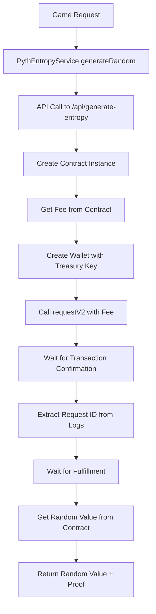
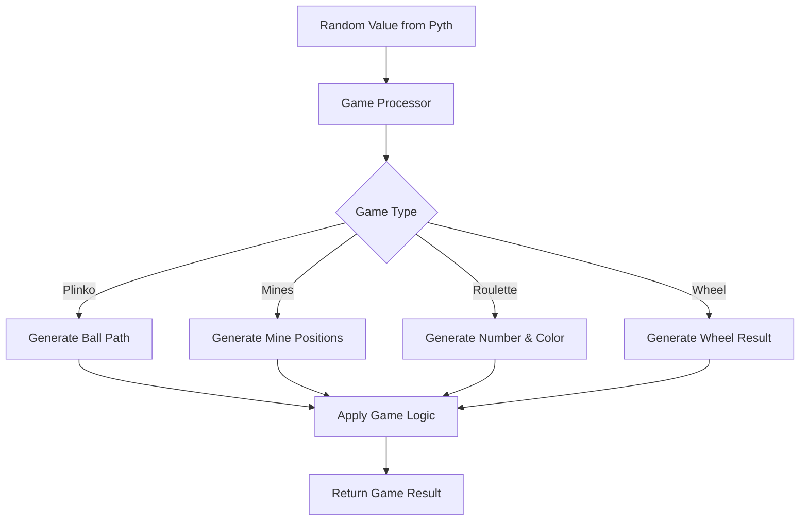

# Pyth Entropy Randomness Logic Documentation

## Overview
This document explains the complete Pyth Entropy randomness implementation in the APT Casino project. The system uses Pyth Network's entropy service to generate verifiable random numbers for casino games.

## Architecture

### 1. Core Service Layer
**File: `src/services/PythEntropyService.js`**

The main service that handles all Pyth Entropy interactions:

```javascript
class PythEntropyService {
  constructor() {
    this.contractABI = [
      "function requestV2(uint32 gasLimit) external payable returns (uint64)",
      "function getRandomValue(bytes32 requestId) external view returns (bytes32)",
      "function isRequestFulfilled(bytes32 requestId) external view returns (bool)",
      "function getRequest(bytes32 requestId) external view returns (bool, bytes32, uint64, uint256)",
      "function getFeeV2(uint32 gasLimit) external view returns (uint256)",
      "event RandomnessRequested(bytes32 indexed requestId, address indexed provider, bytes32 userRandomNumber, uint64 sequenceNumber, address requester)",
      "event RandomnessFulfilled(bytes32 indexed requestId, bytes32 randomValue)"
    ];
  }
```

**Key Methods:**
- `generateRandom(gameType, gameConfig)` - Main method to generate random numbers
- `initialize(network)` - Initialize the service with network configuration
- `waitForFulfillment(requestId)` - Wait for entropy request to be fulfilled
- `extractRequestIdFromLogs(logs)` - Extract request ID from transaction logs

### 2. API Layer
**File: `src/app/api/generate-entropy/route.js`**

The API endpoint that directly interacts with Pyth Entropy contract:

```javascript
export async function POST(request) {
  // Create provider and contract instance
  const provider = new ethers.JsonRpcProvider(ARBITRUM_SEPOLIA_RPC);
  const contract = new ethers.Contract(PYTH_ENTROPY_ADDRESS, PYTH_ENTROPY_ABI, provider);
  
  // Get fee and create wallet
  const fee = await contract.getFeeV2(200000);
  const wallet = new ethers.Wallet(privateKey, provider);
  
  // Request random value
  const tx = await contractWithSigner.requestV2(200000, {
    value: fee,
    gasLimit: 500000
  });
  
  // Extract request ID and get random value
  const requestId = extractRequestIdFromLogs(receipt.logs);
  const randomValue = await contract.getRandomValue(requestId);
}
```

### 3. Configuration
**File: `src/config/pythEntropy.js`**

Network and contract configuration:

```javascript
export const PYTH_ENTROPY_CONFIG = {
  NETWORKS: {
    'arbitrum-sepolia': {
      chainId: 421614,
      entropyContract: '0x549ebba8036ab746611b4ffa1423eb0a4df61440',
      entropyProvider: '0x6CC14824Ea2918f5De5C2f75A9Da968ad4BD6344',
      rpcUrl: 'https://sepolia-rollup.arbitrum.io/rpc'
    }
  }
};
```

## Game-Specific Processors

### 1. Plinko Game Processor
**File: `src/services/gameProcessors/PlinkoResultProcessor.js`**

Converts entropy values into ball paths for Plinko game:

```javascript
processEntropy(entropyValue, gameConfig) {
  const entropyBigInt = typeof entropyValue === 'string' ? BigInt(entropyValue) : entropyValue;
  
  // Generate ball path with controlled randomness
  const ballPath = this.generateBallPath(entropyBigInt, rows);
  
  // Calculate final position
  const finalPosition = this.calculateFinalPosition(ballPath);
  
  return {
    gameType: 'PLINKO',
    ballPath,
    finalPosition,
    payoutMultiplier: multipliers[finalPosition]
  };
}

generateBallPath(entropyValue, rows) {
  const path = [];
  let seed = entropyValue;
  
  for (let row = 0; row < rows; row++) {
    // Use controlled randomness to prevent extreme outcomes
    const rawRandom = Number(seed % BigInt(1000));
    
    // Apply bias towards center
    const centerBias = this.calculateCenterBias(row, rows);
    const biasedRandom = this.applyBias(rawRandom, centerBias);
    
    // Determine direction (0 = left, 1 = right)
    const direction = biasedRandom < 500 ? 0 : 1;
    path.push(direction);
    
    // Update seed for next iteration
    seed = seed / BigInt(1000);
  }
  
  return path;
}
```

### 2. Mines Game Processor
**File: `src/services/gameProcessors/MinesResultProcessor.js`**

Generates mine positions using Fisher-Yates shuffle:

```javascript
processEntropy(entropyValue, gameConfig) {
  const entropyBigInt = typeof entropyValue === 'string' ? BigInt(entropyValue) : entropyValue;
  
  // Generate mine positions using Fisher-Yates shuffle
  const minePositions = this.generateMinePositions(entropyBigInt, mineCount);
  
  return {
    gameType: 'MINES',
    minePositions: minePositions.sort((a, b) => a - b),
    mineCount,
    safePositions: this.getSafePositions(minePositions)
  };
}

generateMinePositions(entropyValue, mineCount) {
  const positions = Array.from({ length: this.gridSize }, (_, i) => i);
  const minePositions = [];
  let seed = entropyValue;

  // Use Fisher-Yates shuffle to select mine positions
  for (let i = 0; i < mineCount; i++) {
    const remainingPositions = positions.length;
    const randomIndex = Number(seed % BigInt(remainingPositions));
    
    const selectedPosition = positions.splice(randomIndex, 1)[0];
    minePositions.push(selectedPosition);
    
    seed = seed / BigInt(remainingPositions);
  }

  return minePositions;
}
```

### 3. Roulette Game Processor
**File: `src/services/gameProcessors/RouletteResultProcessor.js`**

Generates roulette numbers and colors:

```javascript
processEntropy(entropyValue, gameConfig) {
  const entropyBigInt = typeof entropyValue === 'string' ? BigInt(entropyValue) : entropyValue;
  
  // Generate roulette number (0-36)
  const number = this.generateRouletteNumber(entropyBigInt);
  
  // Determine color
  const color = this.getColor(number);
  
  return {
    gameType: 'ROULETTE',
    number,
    color,
    properties: this.getNumberProperties(number)
  };
}

generateRouletteNumber(entropyValue) {
  // Use modulo operation to get number in range 0-36
  const number = Number(entropyValue % BigInt(this.totalNumbers));
  return number;
}
```

## Randomness Flow

### 1. Request Generation


### 2. Game Processing


## Key Features

### 1. Verifiable Randomness
- Uses Pyth Network's entropy service for cryptographically secure randomness
- Each random value comes with a transaction proof
- Request ID and sequence number for verification

### 2. Fallback Mechanism
```javascript
// If API fails, generate fallback random value
const fallbackRequestId = ethers.keccak256(
  ethers.AbiCoder.defaultAbiCoder().encode(
    ['string', 'uint256'],
    [gameType, Date.now()]
  )
);

return {
  randomValue: Math.floor(Math.random() * 1000000),
  entropyProof: {
    requestId: fallbackRequestId,
    source: 'Pyth Entropy (Fallback)'
  }
};
```

### 3. Controlled Randomness
- Plinko uses center bias to prevent extreme outcomes
- Mines uses Fisher-Yates shuffle for fair distribution
- All games use deterministic algorithms with entropy seeds

### 4. Proof Generation
Each random generation includes:
- Request ID from Pyth contract
- Transaction hash and block number
- Arbiscan and Pyth Explorer URLs
- Timestamp and source information

## Usage Examples

### 1. Generate Random for Plinko
```javascript
const pythService = new PythEntropyService();
await pythService.initialize('arbitrum-sepolia');

const result = await pythService.generateRandom('PLINKO', {
  rows: 12
});

// result.randomValue contains the entropy value
// result.entropyProof contains verification data
```

### 2. Process Game Result
```javascript
const processor = new PlinkoResultProcessor();
const gameResult = processor.processEntropy(result.randomValue, {
  rows: 12
});

// gameResult.ballPath contains the ball's path
// gameResult.finalPosition contains the final position
// gameResult.payoutMultiplier contains the multiplier
```

## Security Considerations

1. **Treasury Wallet**: Uses a dedicated treasury wallet for signing transactions
2. **Fee Management**: Automatically calculates and pays required fees
3. **Verification**: Each result includes cryptographic proof
4. **Fallback**: Graceful degradation if Pyth service is unavailable
5. **Validation**: All game results can be validated against original entropy

## Network Configuration

Currently supports:
- Arbitrum Sepolia (testnet) - Primary
- Arbitrum One (mainnet) - Planned
- Base Sepolia (testnet) - Planned
- Base (mainnet) - Planned
- Blast (mainnet) - Planned

## Error Handling

The system includes comprehensive error handling:
- Network connectivity issues
- Contract interaction failures
- Fee calculation errors
- Request fulfillment timeouts
- Fallback random generation

This implementation ensures fair, verifiable, and secure randomness for all casino games while maintaining high availability through fallback mechanisms.
